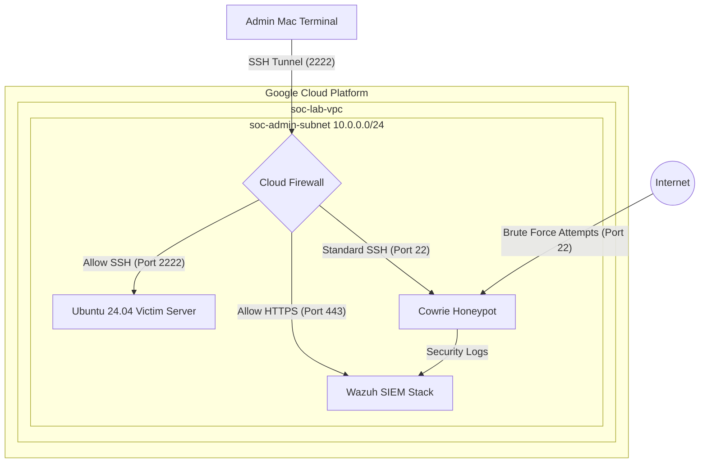

# 🛡️ SOC Home Lab: Cloud-Native Security Monitoring

## 🚀 Project Overview
A cloud-based Security Operations Center (SOC) built to simulate real-world attack and defense scenarios. This lab leverages **Google Cloud Platform (GCP)** to host a hardened "Victim" machine and a centralized SIEM (Wazuh) for threat detection, log aggregation, and incident response.

## 🟡 Project Status: Phase 2 & 3 (SIEM Deployment & Honeypot Initialized)
**Current Focus:** Orchestrating a Dockerized Wazuh SIEM stack, hardening system access via custom SSH ports, and deploying the Cowrie Honeypot for threat intelligence gathering.

---

## 🏗️ Architecture & Network Topology
This lab leverages a cloud-native approach to simulate a realistic enterprise environment.

### Part 2: Updated Tech Stack & Quick Links
*I updated your Tech Stack to reflect the `e2-medium` upgrade and the Wazuh status.*

## 🛠️ Tech Stack & Configuration
| Component | Technology | Configuration | Status |
| :--- | :--- | :--- | :--- |
| **Infrastructure** | Google Cloud (GCP) | `e2-medium` (Scaled from micro) | ✅ Active |
| **Network** | Custom VPC | Static IP reserved / Custom SSH (2222) | ✅ Active |
| **SIEM / XDR** | Wazuh | Dockerized Indexer, Manager, Dashboard | ✅ Active |
| **Honeypot** | Cowrie | High-interaction SSH/Telnet Trap | 🚧 Initialized |
| **Threat Intelligence**| Custom Decoders | Mapping Cowrie logs to Wazuh | ⏳ Pending |

---

## 📂 Detailed Progress & Documentation
For a deep dive into the technical challenges, troubleshooting, and configuration logs, see the following:
* **[Daily Progress Logs](./daily-logs/log.md):** Day-by-day account of the build.
* **[Phase 1: Infrastructure](./docs/phase1-infrastructure.md):** Setting up the GCP environment.
* **[Phase 2: SIEM & Scaling](./docs/phase2-deployment.md):** Troubleshooting RAM and Networking issues.

---

## 📚 Learning Resources & References
* **Cloud Infrastructure:** [Google Cloud VPC Documentation](https://cloud.google.com/vpc/docs/vpc)
* **SIEM Tools:** [Wazuh Documentation](https://documentation.wazuh.com/)
* **Honeypot Research:** [Cowrie Honeypot GitHub](https://github.com/cowrie/cowrie)
* **Academic Context:** Integrating principles from **AltSchool Africa** and **University of Lagos (UNILAG)** Cybersecurity curriculum
