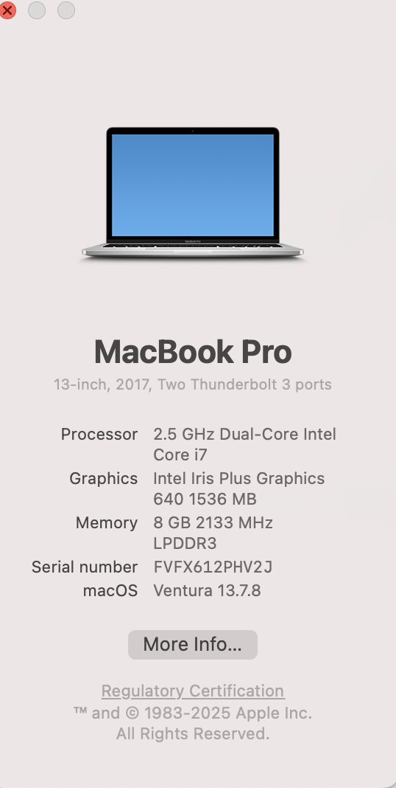

# Project Daily Logs
This file tracks my daily progress, technical challenges, and solutions for the SOC Home Lab project.

## Feb 7, 2026: Environment Initialization

* **Task:** Initialized GitHub repository and finalized project architecture.
* **Decision:** Switched to a Cloud-Native (GCP) approach to optimize for hardware (8GB RAM).
* **Next Step:** Provisioning the VPC network and firewall rules in Google Cloud.
