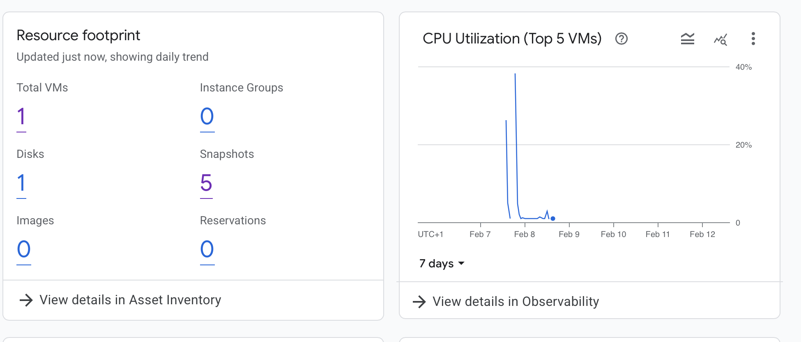
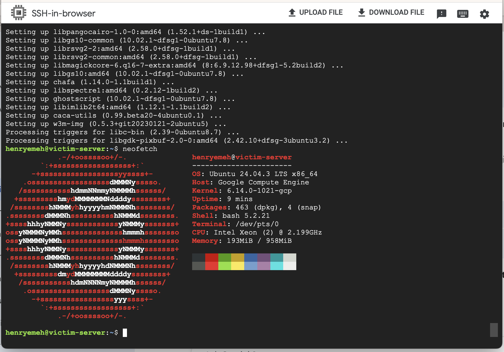

# Phase 1: Infrastructure Provisioning
**Status:** ✅ Complete
**Date:** Feb 7, 2026

## 1. Project Goal
To provision a secure, cloud-native environment on Google Cloud Platform (GCP) that mimics a real-world enterprise network, serving as the target for future security monitoring and attack simulations.

## 2. Infrastructure Architecture
* **Cloud Provider:** Google Cloud Platform (GCP)
* **Region:** `us-central1` (Low latency, Free Tier eligible)
* **Network (VPC):** `soc-lab-vpc` (Custom Mode)
* **Subnet:** `10.0.0.0/24` (Isolated private range)
* **Compute:** `e2-micro` instance running **Ubuntu 24.04 LTS**.

## 3. Security Challenges & Troubleshooting
### Issue: The "Code 4003" Connectivity Block
**Problem:**
Initial attempts to SSH into the victim server via the GCP Console failed with `Connection Failed - Code 4003`.
* **Root Cause:** My "Least Privilege" firewall strategy (Deny All Ingress) inadvertently blocked Google's **Identity-Aware Proxy (IAP)** service, which is required for browser-based SSH.

### The Fix: IAP Allow-Listing
I created a specific Firewall Rule to allow TCP traffic on Port 22 *only* from Google's known IAP IP range.
* **Source Filter:** `35.235.240.0/20` (Google IAP Range)
* **Action:** Allow
* **Priority:** 1000

## 4. Verification
* Validated connectivity via local terminal using `gcloud compute ssh`.
* Confirmed OS version and resource usage.

