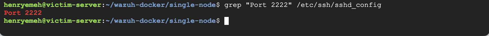

# Phase 2: SIEM Deployment & Infrastructure Scaling
**Status:** ✅ Complete
**Date:** Feb 12, 2026

## 1. Project Goal
To deploy a containerized **Wazuh SIEM (Security Information and Event Management)** stack to monitor the cloud environment, while managing cloud resource constraints and configuring custom network ingress rules.

## 2. Infrastructure Upgrades
* **Compute:** Upgraded from `e2-micro` (2 vCPU, 1GB RAM) to **`e2-medium`** (2 vCPU, 4GB RAM).
* **Storage:** 30GB Balanced Persistent Disk.
* **Networking:** Promoted ephemeral external IP to **Static IP** (`34.55.189.82`) to ensure consistent dashboard access.

## 3. Technical Challenges & Troubleshooting
This phase required significant debugging of Docker resource constraints and GCP VPC firewall logic.

### Issue 1: The "OOM Kill" (Resource Exhaustion)
**Problem:**
The Wazuh Indexer container repeatedly crashed immediately after startup.
* **Diagnosis:** Running `docker logs` revealed Java "Out of Memory" errors. The `e2-micro` instance (1GB RAM) could not support the Elasticsearch/OpenSearch Java heap requirements.
* **The Fix:** performed a **Vertical Scale-Up**.
    1. Stopped the VM instance.
    2. Changed machine type to `e2-medium`.
    3. Verified stability using `docker stats` (Indexer stabilized at ~1.4GB RAM usage).

### Issue 2: The "Ghost" Firewall Rule (VPC Mismatch)
**Problem:**
Despite the Wazuh containers reporting `healthy`, the web dashboard was unreachable via the browser.
* **Root Cause:** A **Network Mismatch**. The Firewall Rule allowing traffic on Port 443 was created on the `default` VPC network, but the VM was running on the custom `soc-lab-vpc`.
* **The Fix:** Created a new Firewall Rule explicitly targeting the `soc-lab-vpc` network with a source filter of `0.0.0.0/0`.

### Issue 3: The "Fat Finger" Typo (Port 433 vs 443)
**Problem:**
After fixing the VPC mismatch, the connection was still refused.
* **Root Cause:** Human error in the Firewall Rule definition. The allowed port was typed as `tcp:433` instead of the standard HTTPS port `tcp:443`.
* **The Fix:** Edited the active firewall rule to correct the port number. Connectivity was restored immediately.

## 4. System Hardening (SSH)
To prepare for the Honeypot deployment (Phase 3), I moved the administrative SSH access to a non-standard port.
* **Action:** Changed SSH daemon configuration (`/etc/ssh/sshd_config`) to listen on **Port 2222**.
* **Safety Step:** Created a GCP Firewall Rule allowing `tcp:2222` *before* restarting the SSH service to prevent lockout.

## 5. Verification
* **Service Status:** Confirmed Wazuh Manager, Indexer, and Dashboard are `healthy`.
* **Access:** Successfully logged into Wazuh Dashboard via Static IP.
* **Telemetry:** Verified 150+ initial security events generated by the system startup.

